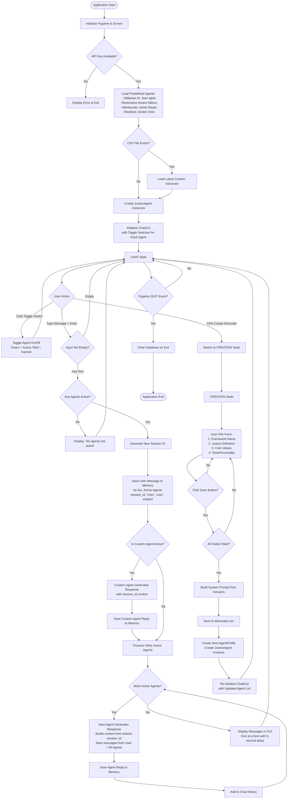
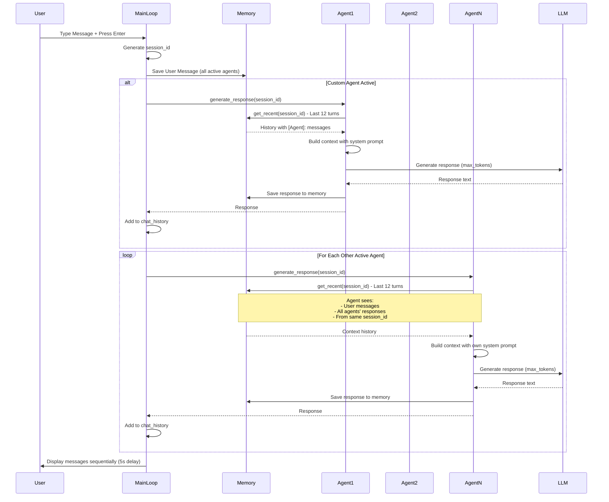
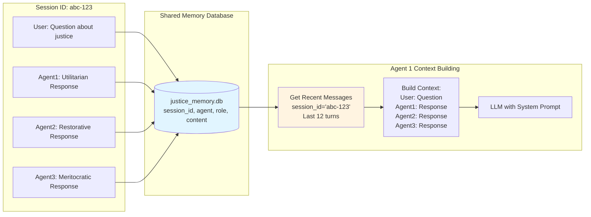

# User Interaction Flow with Multiple Agents

## Agent Response Generation Detail

## Memory & Context Sharing

## Key Interaction Points

1. **Agent Activation**: Users toggle agents on/off via switches in the top-left
2. **Shared Context**: All active agents see the same conversation via shared
   `session_id`
3. **Sequential Responses**: Custom agent responds first (if active), then
   others sequentially
4. **Memory Window**: Each agent sees the last 12 turns (30-minute rolling
   window)
5. **Message Display**: Messages shown one at a time with 5-second intervals
6. **Custom Advocate Creation**: Users can create new agents that join the
   conversation
